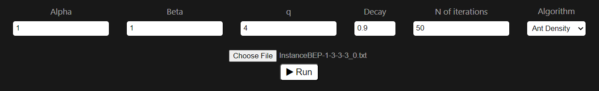
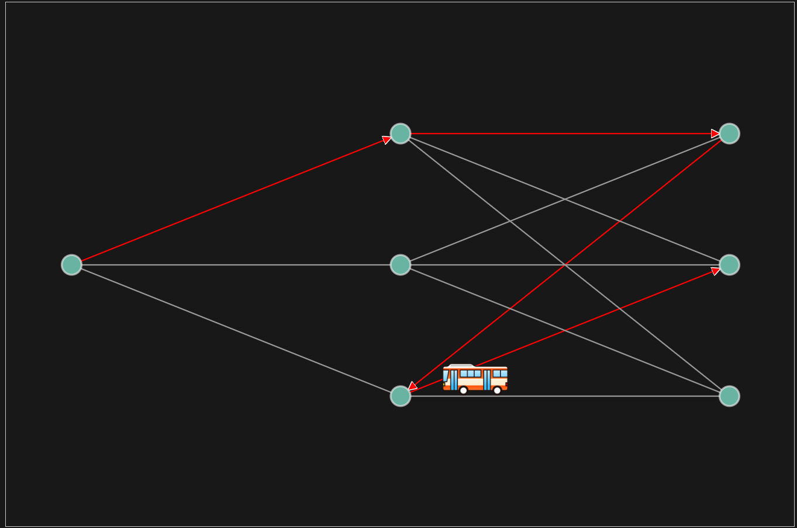
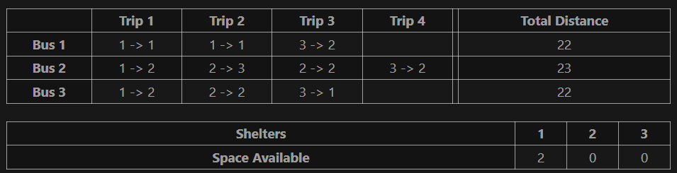
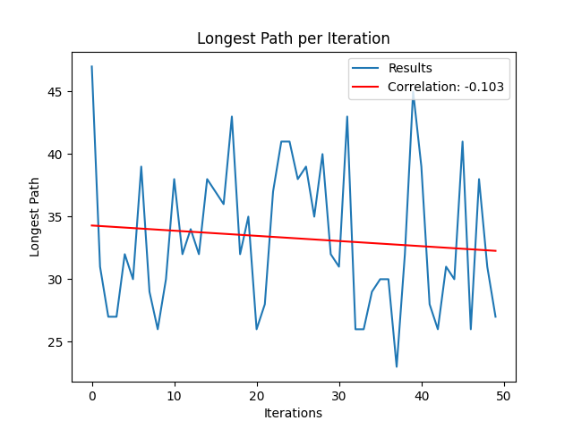

# Bus Evacuation Problem with Ant Colony Optimization Route Visualization

This repository contains an API made in Flask and a website designed with Vue. The purpose of this project is to display routes for multiple buses, which evacuate multiple people that are in a dangerous situation (earthquakes, fires and emergencies). 

The **Bus Evacuation Problem** (BEP) is a very difficult problem to optimize, being very similar to the Vehicle Routing Problem (VRP) in concept and in their solution methods. This project implemented the **Ant Colony Optimization** (ACO) heuristic, which takes inspiration from ants communication to find better solutions or shorter paths. Buses spread *pheromones* in taken paths, and buses will tend to follow those paths with a larger number of pheromones, although they might also take paths with lesser number of pheromones since this movement is randomized.

## Parameters

An ACO algorithm has many important parameters, such as:

* **Alpha** ($\alpha$): a number greater or equal to 0 that resembles the importance of pheromones in the algorithm.
* **Beta** ($\beta$): a number greater or equal to 0 that resembles the importance of distances in the algorithm.
* **q**: the number of pheromones released by each ant.
* **Decay**: a greater than 0 but lesser than 1 number that is multiplied with every pheromone to express their decay over time.
* **Number of iterations**: number of times the algorithm is run.
* **Algorithm**: it might be
    - Ant Density
    - Ant Quantity
    - Ant Cycle

## Graph

This map's problem is usually displayed as a graph such as the following: 

These graphs have 2 mayor components:

* Node: they can be a **starting point** (where buses are located at the start of the evacuation), **meeting point** (where people in danger have to meet) and **shelters** (where people rest and are safe).

* Path: a bidirectional connection between two nodes. They have an assigned cost to traverse (time or distance). They will be colored in red if a bus route has one of those paths, and an arrow to display a direction. By hovering a path the distance between two nodes will be displayed.

Meeting points and shelters are fully-connected, so any node can be reached from another. An animation can be played to display the route, since sometimes it can be very confusing to follow a route only with colored paths and arrows.

## Data

This problem's data is displayed primarily in the following tables, the first being buses routes and the latter the shelters remaining space.

A bus's first trip will always be from a starting point to a meeting point, but the remaining trips will be from a meeting point to a shelter; the movement from a shelter to a meeting point is not clearly displayed, but the next trip starts where the last trip ended. A bus's total distance is also shown in the first table, and that is the sum of all distances travelled by a bus.

## Graphics

This form of visualization is very important since the number of iterations can be so large and an algorithm that its purpose is to get better results, that improvement should be displayed in a simple way.

